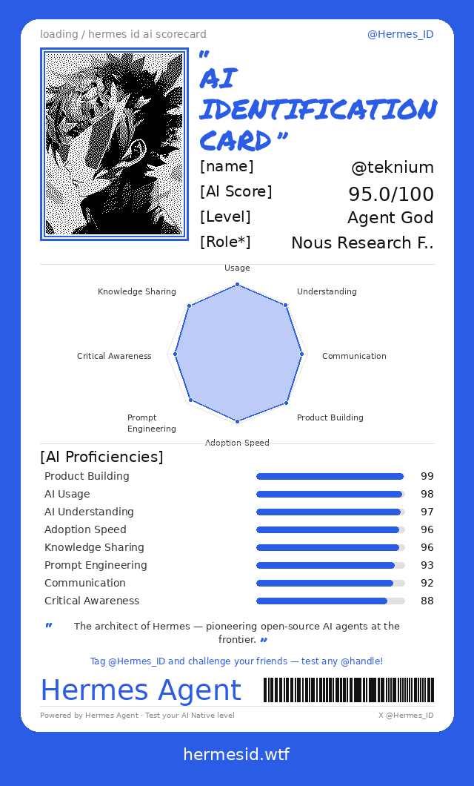
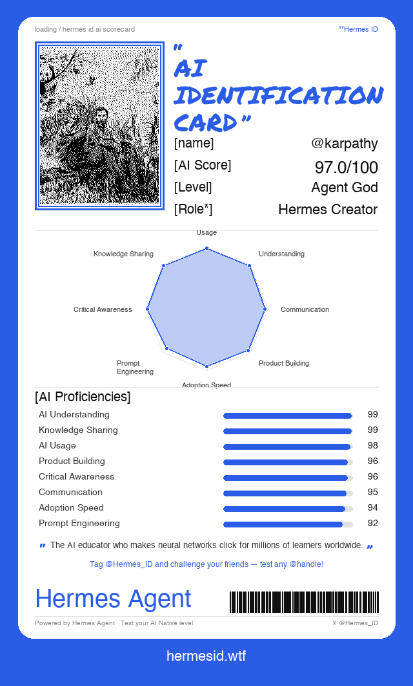
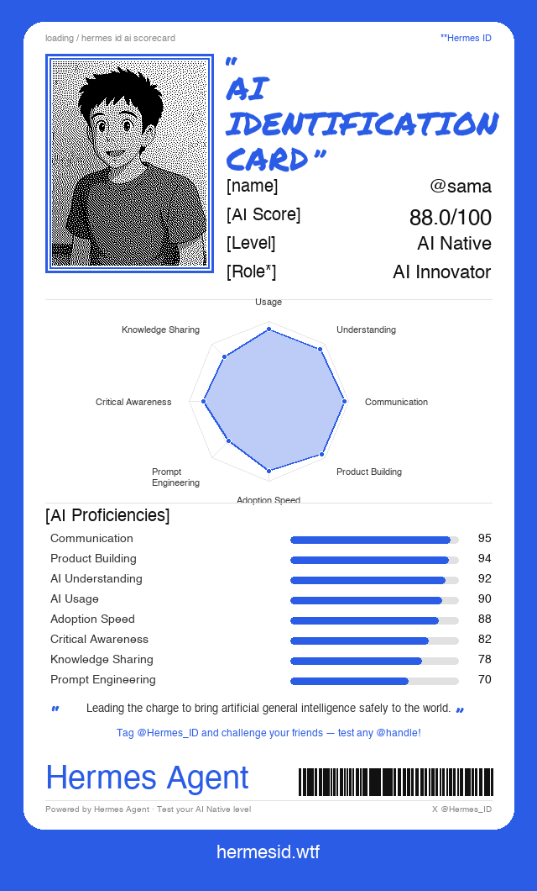
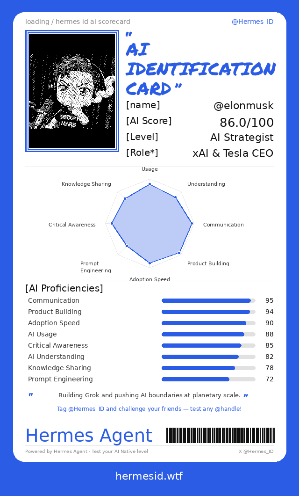
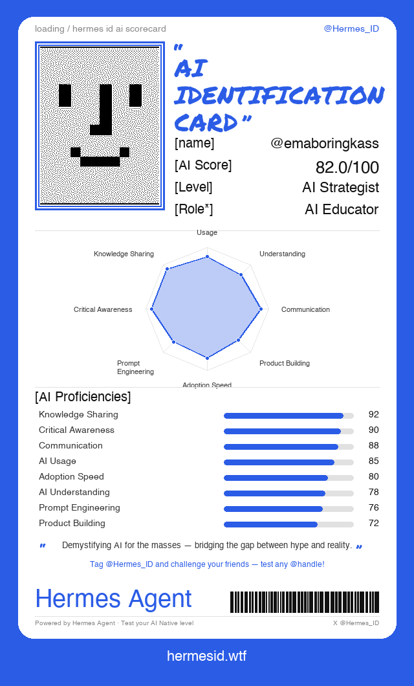

<p align="center">
  
</p>

<h1 align="center">Hermes ID</h1>

<p align="center">
  <strong>AI Identification Card — Test your AI Native level.</strong>
</p>

<p align="center">
  <a href="https://hermesid.wtf"></a>
  <a href="https://x.com/Hermes_ID"></a>
  <a href="https://github.com/hermes-intel/hermes-agent/blob/main/LICENSE"></a>
  <a href="https://hermes-agent.nousresearch.com/docs/"></a>
</p>

<br>

<p align="center">
  
  
  
  
</p>

<p align="center"><em>Real AI proficiency cards — generated from public X data</em></p>

---

## What is Hermes ID?

Hermes ID is an **AI capability intelligent assessment tool** powered by [Hermes Agent](https://hermes-agent.nousresearch.com/docs/).

Enter any X/Twitter handle. Hermes Agent automatically scrapes and deeply analyzes the account's recent public tweets, then outputs a **total AI Score (0–100)**, a multi-dimensional proficiency profile, and a **shareable card image** — all in one step.

**One-line pitch:** *For the AI era — test how AI Native you really are.*

### Core Value

- Satisfy the urge to show off, self-reflect, and compare
- Rapidly build Hermes Agent's presence in the AI community
- A viral-ready micro-product, easy for KOLs to share and attract new users

---

## How It Works

```
@teknium  →  Scrape tweets  →  LLM analysis  →  Generate card  →  Share on X
```

1. **Input** — Provide any X handle (your own or anyone else's)
2. **Scrape** — Hermes Agent collects 30–90 days of recent public tweets
3. **Analyze** — LLM scores the user across 8 AI proficiency dimensions with evidence-based reasoning
4. **Generate** — Python generates a card image with halftone avatar, radar chart, progress bars, and barcode
5. **Share** — Get the card + one-click share link for X with Twitter Card preview

---

## 8 Scoring Dimensions

Every score is **evidence-based** — backed by specific tweet content. No speculation, no inflation.

| Dimension | Weight | What It Measures |
|-----------|--------|-----------------|
| **AI Usage** | 15% | Frequency and breadth of actual AI tool use |
| **AI Understanding** | 15% | Depth of technical AI/ML knowledge |
| **Communication** | 12% | Quality of AI community engagement |
| **Product Building** | 15% | Actually shipping things built with AI |
| **Adoption Speed** | 12% | How fast they try new AI releases |
| **Prompt Engineering** | 10% | Sophistication of prompting techniques |
| **Critical Awareness** | 10% | Understanding of AI limitations and risks |
| **Knowledge Sharing** | 11% | Teaching and educating others about AI |

**Total Score** = weighted average across all dimensions.

### Level Thresholds

| Score | Level | Description |
|-------|-------|-------------|
| 95–100 | **Agent God** | Pinnacle of AI mastery. Builds, teaches, innovates, and shapes the field. |
| 88–94 | **AI Native** | AI is fully integrated into their identity and work. |
| 78–87 | **AI Strategist** | Strong, well-rounded AI skills. Clearly ahead of the curve. |
| 65–77 | **AI Explorer** | Active AI user and learner. Solid foundation, room to grow. |
| 50–64 | **AI Curious** | Beginning their AI journey. Interested but limited depth. |
| 35–49 | **AI Aware** | Some awareness of AI, limited engagement. |
| 0–34 | **AI Normie** | Little to no AI engagement visible in public content. |

---

## Card Features

<p align="center">
  
</p>

Each generated card includes:

- **Real X profile picture** with manga-style halftone filter
- **8-axis radar chart** for visual dimension overview
- **Progress bars** for detailed score breakdown
- **AI Score, Level, and Role** assignment
- **Personalized summary** — a shareable one-liner
- **Unique barcode** per handle
- **Share CTA** — "Tag @Hermes_ID and challenge your friends"

---

## Quick Start

### Generate a Card (No API Key Needed)

```bash
git clone https://github.com/hermes-intel/hermes-agent.git
cd hermes-agent/skills/social-media/hermes-id

pip install Pillow

# Generate a test card with sample scores
python3 test_e2e.py teknium --card-only
# → Card saved: /tmp/hermes_id_teknium.png
```

### Full Pipeline (Real LLM Analysis)

```bash
# Set one of these API keys:
export OPENAI_API_KEY="sk-..."
# or: export OPENROUTER_API_KEY="sk-..."
# or: export ANTHROPIC_API_KEY="sk-..."

# Run the complete pipeline: scrape → analyze → generate
python3 test_e2e.py teknium

# Try any X handle
python3 test_e2e.py elonmusk
python3 test_e2e.py karpathy
```

### Use the Card Generator Directly

```bash
# Create a score JSON
cat > /tmp/score.json << 'EOF'
{
  "handle": "yourhandle",
  "total_score": 85,
  "level": "AI Strategist",
  "role": "AI Architect",
  "summary": "A hands-on builder shipping AI tools at the frontier.",
  "dimensions": [
    {"name": "AI Usage", "score": 90},
    {"name": "AI Understanding", "score": 88},
    {"name": "Communication", "score": 75},
    {"name": "Product Building", "score": 92},
    {"name": "Adoption Speed", "score": 85},
    {"name": "Prompt Engineering", "score": 78},
    {"name": "Critical Awareness", "score": 70},
    {"name": "Knowledge Sharing", "score": 82}
  ]
}
EOF

# Generate the card
python3 skills/social-media/hermes-id/references/generate_card.py /tmp/score.json /tmp/my_card.png
```

### Using with Hermes Agent

Install the skill in Hermes Agent and simply chat:

```
> @teknium
> Score @elonmusk's AI level
> Generate an AI ID card for @karpathy
```

Hermes Agent will automatically activate the Hermes ID skill, scrape tweets, run LLM analysis, generate the card, and present results with a share link.

---

## Website

**[hermesid.wtf](https://hermesid.wtf)** — The public-facing website with:

- Interactive card gallery featuring AI leaders
- **"Get Your Card"** — enter any X handle to generate a card instantly
- **Share on X** with rich Twitter Card previews (card image appears in the tweet)
- **Download** card as PNG for manual sharing
- Cyberpunk aesthetic with ASCII rain, 3D card flip animations, glowing aura

### Deploy Your Own

```bash
cd site/
pip install -r requirements.txt

# Run the card API server
python card_api.py
# → http://127.0.0.1:5050

# Test
curl http://127.0.0.1:5050/api/card?handle=teknium -o test.png
```

See [`site/README.md`](site/README.md) for full deployment instructions (nginx, SSL, systemd).

### API Endpoints

| Endpoint | Description |
|----------|-------------|
| `GET /api/card?handle=xxx` | Generate and return a PNG card image |
| `GET /card/<handle>` | HTML page with Twitter Card meta tags for rich link previews |
| `GET /api/health` | Health check |

---

## Project Structure

```
hermes-agent/
├── skills/social-media/hermes-id/       # Core Hermes ID Skill
│   ├── SKILL.md                         # Skill definition (workflow + LLM prompt)
│   ├── README.md                        # Skill documentation
│   ├── test_e2e.py                      # End-to-end pipeline test
│   ├── requirements.txt                 # Python dependencies
│   └── references/
│       ├── generate_card.py             # Card image generator (PIL/Pillow)
│       └── scoring-rubric.md            # Detailed scoring criteria
├── site/                                # Website (hermesid.wtf)
│   ├── index.html                       # Landing page
│   ├── card_api.py                      # Flask API for dynamic card generation
│   ├── favicon.png                      # Site icon
│   ├── requirements.txt                 # API dependencies
│   ├── README.md                        # Deployment guide
│   └── cards/                           # Pre-generated example cards
│       ├── teknium.png
│       ├── karpathy.png
│       ├── sama.png
│       ├── elonmusk.png
│       └── emaboringkass.png
└── ...                                  # Hermes Agent core (upstream)
```

---

## Technical Architecture

| Component | Technology | Purpose |
|-----------|-----------|---------|
| **Skill Engine** | Hermes Agent + SKILL.md | Workflow orchestration, browser scraping, tool coordination |
| **LLM Analysis** | OpenAI / OpenRouter / Anthropic | Multi-dimensional scoring with evidence-based reasoning |
| **Card Generator** | Python + Pillow (PIL) | Pixel-perfect card image rendering |
| **Avatar Service** | [unavatar.io](https://unavatar.io) | Free X profile picture fetching (no API key needed) |
| **Website** | HTML/CSS/JS + Canvas API + Web Audio API | Landing page with interactive animations |
| **Card API** | Flask + Gunicorn | Dynamic card generation + Twitter Card meta tags |
| **Hosting** | Nginx + Let's Encrypt | Static serving + API proxy + SSL |

---

## Viral Mechanics

- Cards include CTA: *"Tag @Hermes_ID and challenge your friends — test any @handle!"*
- Share links come pre-filled with tweet text mentioning @Hermes_ID
- Twitter Card meta tags ensure card images appear as rich previews in tweets
- Seed strategy: Score AI KOLs and @ them to trigger first wave of shares
- Every card is unique and personalized — high share motivation

---

## Target Users

**Primary:** AI enthusiasts, developers, KOLs, researchers, agent builders, tech bloggers, product managers, founders

**Secondary:** Recruiters (quick AI capability assessment), community managers (identify high-potential builders), investors (evaluate candidates)

---

## Contributing

```bash
git clone https://github.com/hermes-intel/hermes-agent.git
cd hermes-agent
pip install Pillow  # for card generation
```

See the [Contributing Guide](CONTRIBUTING.md) for development setup and PR process.

---

## Community

- [hermesid.wtf](https://hermesid.wtf) — Try it now
- [@Hermes_ID on X](https://x.com/Hermes_ID) — Follow for updates
- [GitHub Issues](https://github.com/hermes-intel/hermes-agent/issues) — Bug reports and feature requests

---

## License

MIT — see [LICENSE](LICENSE).

Powered by [Hermes Agent](https://hermes-agent.nousresearch.com/docs/).
